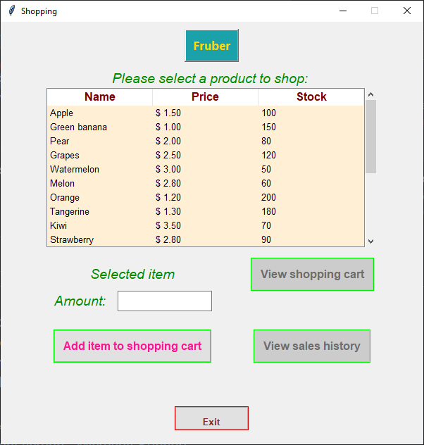
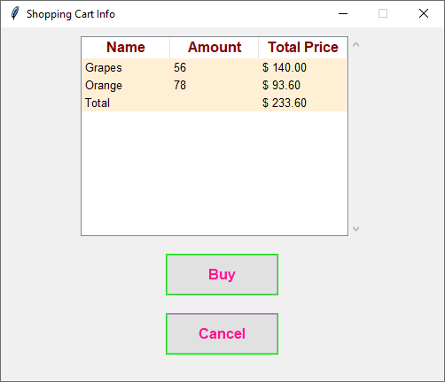
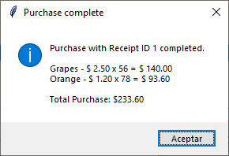
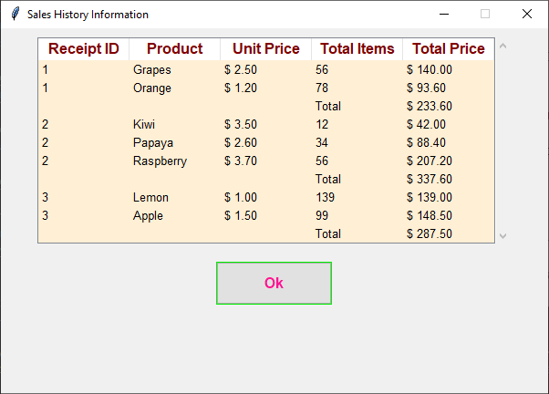
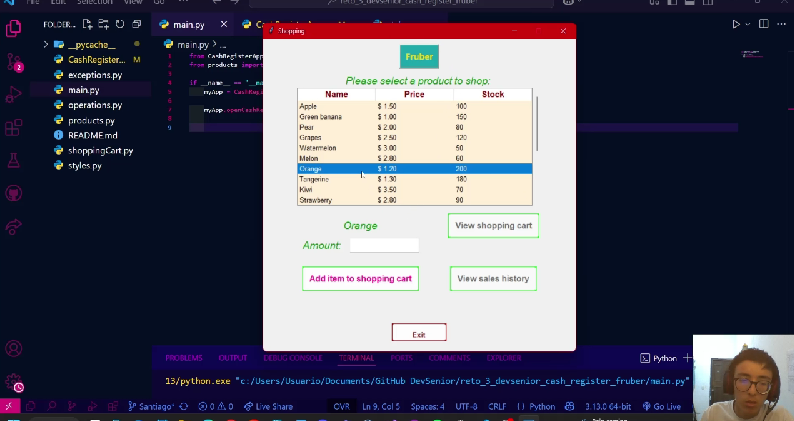

# Reto 3 Dev Senior - Python: Caja Registradora Fruber  🐍🍇🍍🍋🍉

## Sistema de Caja Registradora para una Tienda Fruber - Gestionando la venta de productos por medio de una caja registradora.

Para este reto se ha usado la biblioteca Tkinter para la creación de una interfaz gráfica que permita la gestión de caja registradora, ttk para mejorar la apariencia, se ha hecho el respectivo manejo de errores y se ha organizado el código en  múltiples archivos.

El presente repositorio corresponde al desarrollo de las actividades propuestas para el reto #3 del curso de Python de Dev-Senior. 

Los autores somos **Lindsey Acourtt** y **Santiago Torres**.

La solucion de nuestro reto cuenta con 6 archivos:
* CashregisterApp.py
* exceptions.py
* main.py
* operations.py
* products.py
* styles.py

### CashregisterApp.py

En CashregisterApp tenemos la inplementación de la interfaz gráfica, así como las operaciones principales que se utilizan en la caja registradora que son: agregar ítem a carrito de compras, abrir o mostrar el carrito de compras, comprar, calcular el total de la compra y ver el historial de todas las compras. 

### exceptions.py

En excepciones, se consideran diferentes clases hijas de "Exception", en la cual se manejan los siguientes errores: 

* `NoProductSelectedError`: Se utiliza cuando el usuario intenta agregar un producto al carrito, sin haber seleccionado un producto. 
* `InvalidNumberInput`: Para cuando el usuario intenta ingresar un número no válido como la cantidad de ítems a comprar. 
* `InsuficientStockError`: Cuando el usuario intenta comprar una cantidad mayor al stock disponible. 

Además se cuentan con dos exception handlers, que se usan para generar pop-ups que indican cuál es el error. Estos son:
* `InvalidNumberInputHandler`
* `InsufficientStockErrorHandler`

### main.py

El main es nuestro archivo principal, donde vamos a ejecutar toda la interfaz gráfica.

Para esto, se crea un objeto de la clase `CashRegisterApp` y se implementa su método "`openCashRegisterMainWindow`"

```
if __name__ == "__main__":
    myApp = CashRegisterApp()

    myApp.openCashRegisterMainWindow(listOfProducts)
```


### operations.py
 
En operations inplementamos funciones que no se relacionan con el manejo de las compras o el inventario. Estas son:

* `centerWindow`: Se usa para centrar todas las ventanas de la interfaz gráfica.
* `updateSelectedProductLabel`: Event handler que se utiliza para actualizar la etiqueta que contiene el nombre del producto seleccionado. 
* `is_valid_number`: Confirma si lo ingresado en la caja de texto es un número válido.

### products.py

En products guardamos nuestros productos disponibles en un diccionario con su nombre, precio y stock

### styles.py

En styles guardamos todos los estilos que le damos a nuestra interfaz gráfica. Hay estilos disponibles para cada componente de la interfaz:

* `title_Styles`
* `apply_Treeview_styles`
* `apply_Frame_styles`
* `apply_Label_styles`
* `apply_Entry_styles`
* `apply_Button_styles`

## Descripción de la aplicación

La aplicación consta de tres ventanas. La primera es la ventana principal donde se muestra la lista de productos disponibles en un componente TreeView. A medida que se seleccionan los productos, hay un componente Label que se actualiza con el nombre del producto seleccionado. Una vez se tiene un producto seleccionado, el usuario puede ingresar la cantidad a comprar en un componente Entry, y agregar el producto al carrito con un componente Button, "Add item to shopping cart". 

Hay dos botones principales más, "View shopping cart" y "View sales history". Cada uno abre dos nuevas ventanas. 



Al dar click en el boton de "View shopping cart" se despliega la siguiete ventana. Esta muestra los productos que han sido agregado al carrito de compras, y el total de ellos. Hay dos botones más, uno para comprar los productos en el carrito de compras, y el otro para cancelar la compra.




El botón de "View sales history"  abrirá la tercera ventana que mostrará el historial de ventas. 



Por ultimo, al dar click en el botón "Exit", se mostrará un mensaje para confirmar que queremos salir y se cerrará nuestra aplicacion de Fruber.   


 ### Librerías y módulos usados
``` 
import tkinter
from tkinter import ttk
from tkinter import messagebox
```

### Versión de Python

Desarrollado en Python 3.13.0.

### Vídeo complementario

[](https://youtu.be/20fCRJm-HXM)


